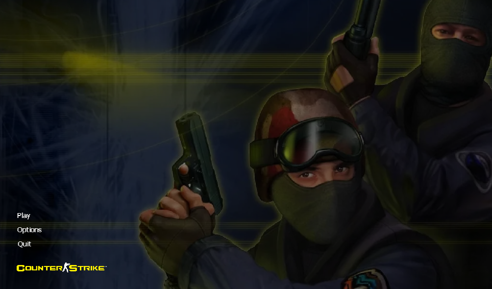
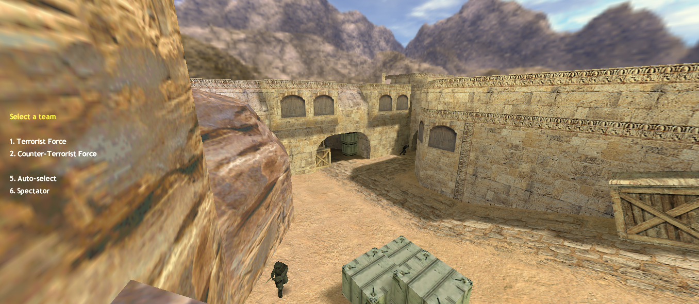
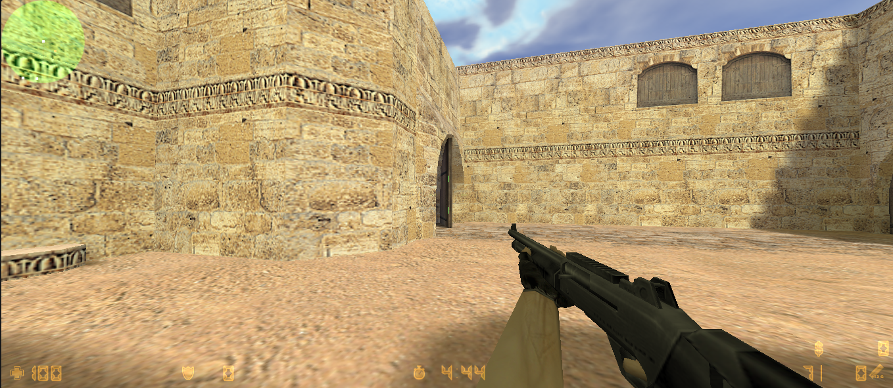
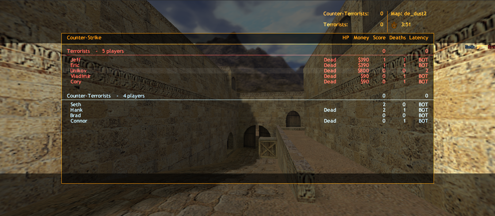

CS web is a web port of Counter Strike 1.6 built by athyx. This is running in a browser because of Xash 3D FWGS, and this post on reddit https://www.reddit.com/r/webdev/comments/1maki0o/run_counterstrike_16_in_your_browser_with_just/. This web cs client uses a custom made menu to hide the old valve menu that doesnt allow you to start a game with bots. Remember i do not own valve.zip it belongs to the respective owners. Also shout out to https://cs16.samke.me/ for the custom css library of Counter Strike 1.6 .

## Screenshots

